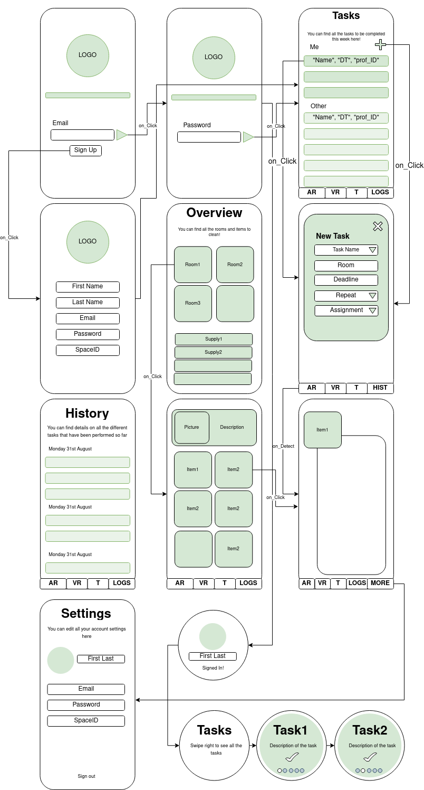

# tidy_app

## Objective
Develop an app to help people living in a colocation organize the cleaning of their space. 

## Material required
Android Tablet, Watch

## Description
The application is made primarily for organizations and landlords that rent out colocation spaces. These administrators, or Admins, can set up spaces within the colocation, add cleaning supplies available, and add tasks that need to be done regularly. Then, the app is used day to day by people who inhabit the colocation, the Tenants,  to remain organized and track cleaning progress within the flatshare. This helps ensure that cleaning of common spaces is done regularly, fairly, and to the standards of the landlord. 

## Firebase
We used firebase as the cloud storage for this project. To access the firebase of this project you can login using these credentials.

## Sign Up/ Login
All users of the app must create an account in order to sign into the app. During sign up, the user must provide a unique Space ID that links the user with a particular space on Firebase. This means that Tenants can only create an account if there is already an existing space. 

## Setting Up Spaces
The space can be set up by those with administrative rights. 

1. Go to  “Settings”, where only Admins can see a button titled “Admin”
2. Click on “Admin” button
3. Choose whether to “Create a new space” or “Edit existing space”. Note that the spaceID of the space needs to be given to edit existing space. The spaceID of the space currently associated with the Admin is auto-populated.
4. Click “Add room” to add rooms to the space. An image must be added. Descriptions are optional. Old rooms can also be edited by clicking on the tile in the recycler view. 
5. Click “Add supply” to add supplies to the space. An image must be added. Descriptions of supplies are mandatory. Old supplies can also be edited by clicking on the supplies in the recycler view. 
6. Click “Add task” to add tasks to specific rooms within the space. Descriptions are optional. For example, the task “Clean floor” can apply to both the Living Room and the Kitchen.

## Completing Tasks
After successfully signing in, regular users are automatically directed to the Tasks page. Here, the user can see all of the pending tasks within the colocation. The ones that belong to the user are highlighted in light red and displayed at the top. The tasks of the other users are shown below in light blue. When a task becomes overdue, the color will change to a darker color. Users can swipe right on their own tasks to mark it as done. Completed tasks will show up in the History page. 

Note that all tasks are assigned randomly to users. Tasks that have not been completed will not be reassigned until it is completed. Tasks are reassigned every day at 3:00 AM (this can be changed). The due date is set to be 2 days after the current date. 

## Changing Account Settings
The Settings page allows users to change their account information.

## Augmented Reality
Clickin on the Augmented Reality tab allows users to visualize information about the space by scanning specific QR codes. The QR code can be found under assets/kitchen.jpg. Pointing the camera at the QR code will reveal a description of the room in addition to a picture of it. When testing, the QR code needs to be placed on a horizontal plane.

## Smart Watch
Click on the app tidy on your smartwatch. It will then prompt you to open the main tidy app on the tablet. 
Log in with your account on the tablet, your information on the will be sent to the watch. This includes your name and the tasks which you need to complete.
Swipe a task to mark it complete (just like in the main app). This will delete it from the view in the watch and send an update to the tablet which performs the necessary actions to delete the task and move it to the history fragment. 
You can now check in the app under history that the update did occur.

Notes: 
If you activate the onDestroy() activity by swiping right on the app in the watch you will have to log in again when you open the watch app.

It is not implemented yet that swiping tasks completed on the tablet will notify the watch. You would have to log back in again for the watch to receive the update. 
